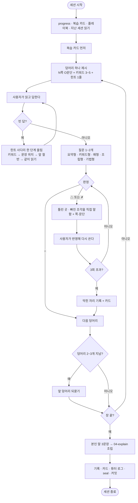

# 논문 튜터 같이 읽기 방식으로 재설계

## 개요

기존 튜터 규칙은 "요약 금지 · 쪽 번호만 제시 · 답해야 다음 구간"이라 사용자가 논문을 혼자 읽고 조수는 채점만 하는 구조였다. 첫 실제 세션에서 사용자가 "한 번에 다 읽으라고 하면 못 읽는다", "같이 읽으면서 씹고 맛보고 싶다"고 밝혀, 읽기 전에 시험지부터 받는 구조 자체가 읽을 동기를 죽인다는 것이 확인됐다. 이번 작업으로 튜터를 **덩어리(문단~소절) 단위 "같이 읽기" 루프**로 바꿨다 — 조수가 키워드와 힌트로 길을 내주고, 사용자가 읽고 답하면, 틀린 곳을 직접 짚어 다시 쓰게 하고, 통과할 때까지 반복한다. 함께 (1) 스캔 원문을 봉함된 텍스트·이미지로 옮겨 세션마다 이미지를 다시 읽지 않게 했고, (2) 어떤 가르침이 이 사용자에게 먹혔는지 기록해 다음 세션이 나아지는 플레이북을 넣었다.

## 기능 흐름

## 변경 사항

### 규칙
- `CLAUDE.md`: 전면 개정. 절대 규칙을 "먼저 다 풀어주지 않는다 · 한 번에 한 덩어리 · 빈 답은 힌트로 받는다 · 틀리면 직접 고쳐주고 다시 쓰게 한다 · 본인 말로" 다섯으로 재정의. §3 덩어리 루프·질문 다섯 유형·힌트 사다리 신설, §4·§5 세션 여닫기에 플레이북과 `text/` 절차 추가, §8 채점을 "판정 → 무엇이 틀렸나 → 쪽·문단 → 다시 쓰기"로, §9 원문 다루기에 텍스트 추출과 그림·표 이미지 규칙, §10 플레이북 승격 규칙, §11 공개 규칙에 `text/` 평문 금지, §12 커밋 타입 `text`·`tutor` 추가
- `.claude/commands/tutor.md`: 세션 열기 순서를 "진도 → 복습 → 플레이북 → 지난 기록 → vault → 이번 쪽 텍스트만 → 첫 덩어리 하나만"으로 교체. 여러 쪽+질문 여러 개를 한 번에 주는 것을 명시적으로 금지

### 스크립트
- `scripts/vault.py`: `papers/*.pdf` 에 더해 `text/<슬러그>/*.md` 와 `text/<슬러그>/pages/*.png` 를 같이 봉하고 연다. 쪽 단위 출력이 25줄씩 찍히지 않도록 슬러그별 한 줄로 묶었고, `status` 가 텍스트·이미지 봉함 수를 보여준다
- `tests/test_vault.py`: pdf·md·png 왕복, 재봉함 결정성, 대상 수집 범위 — unittest 4개 (stdlib 만 사용)
- `.gitignore`: `text/**/*.md` 추가. `.md.enc` 와 `.png.enc` 는 기존 패턴에 걸리지 않아 부정 규칙 불필요

### 튜터 자기개선
- `tutor/playbook.md`: 「검증됨(2회 이상)」·「시도 중」·「버린 것」 세 칸. 첫 항목으로 이번 세션에서 확인된 "여러 쪽+질문 여러 개 한 번에 주기"와 "쪽 번호만 주고 정답 안 말하기"를 버린 것으로 등재
- `tutor/log.md`: 세션별 시도·사용자 반응(말 그대로 인용)·판단 표. 첫 로그는 오늘 설계 세션의 실패와 교정

### 기록 틀
- `notes/ai-privacy-workforce/01-sessions.md`: 세션 단위 → 덩어리 단위. 답1·피드백·답2·판정·카드를 원문 그대로 남기는 형식
- `notes/ai-privacy-workforce/04-explain.md`: 「장별 내 말 요약 (통과한 것만)」 절 추가 — 최종 5분 설명의 재료
- `notes/ai-privacy-workforce/00-meta.md`: `text/` 안내 행 추가
- `progress.md`: 「지금 할 일」을 "1쪽 초록 1문단부터"로

### 원문 텍스트
- `text/ai-privacy-workforce/p01~p25.md.enc`: 25쪽 전부 옮겨 적음. 머리말에 page·journal_page·section·tables·figures·keywords·hints. 표 9개는 md 표로, 그림 3개는 한 줄 설명 + 그림 안의 표·주석은 텍스트로
- `text/ai-privacy-workforce/pages/p03,04,07,09,14,15,16,17,22,23,24.png.enc`: 그림·표·수식이 있는 11쪽의 실제 페이지 이미지(150dpi). 각 md 본문 첫 줄에서 링크

### 설계 문서
- `docs/superpowers/specs/2026-09-03-tutor-redesign-design.md`, `docs/superpowers/plans/2026-09-03-tutor-redesign.md`

## 주요 구현 내용

**왜 "같이 읽기"인가.** 기존 설계는 "읽어도 안 남는다"를 막는 데는 맞았지만(카드·복습·내 말로 설명), "안 읽는다"를 막는 쪽은 거꾸로 갔다. 요약 금지 + 통행세 + 질문 먼저 = "혼자 읽어 와, 채점만 한다". 사용자가 원한 것은 조수가 키워드와 힌트로 길을 내주되 읽는 것은 본인이 하고, 틀리면 무엇이 틀렸는지 듣고 다시 쓰는 것이었다. 그래서 요약 금지는 "먼저 다 풀어주지 않는다"로 완화하고, 채점은 쪽 번호만 짚는 대신 빠진 조각을 직접 말하도록 바꿨다. 남는 것은 사용자가 다시 쓰는 행위에서 나온다.

**왜 OCR 이 아니라 눈으로 옮겨 적었나.** tesseract 가 없기도 했지만, 한국어 학술문은 OCR 정확도가 떨어지고 표·제목 계층·두 단(column) 순서를 잡으려면 어차피 눈이 필요하다. 병렬 에이전트 5개가 각 5쪽씩 150dpi 렌더링을 보며 옮겨 적었고, 확신 없는 글자는 `[?]` 로 표시하게 해 재검토했다 (최종 0개). 절 제목은 `00-meta.md` 쪽 색인과 전부 대조했고, 범위 경계에서 빈 6장 제목은 이어지는 쪽에서 채웠다.

**왜 이미지도 봉하나.** 사용자가 "표·그림은 실제 PDF 를 봐야 한다, OCR 로 뭉개면 안 된다"고 했다. 표는 md 표로 옮기되, 그림·표·수식이 있는 쪽은 실제 페이지 이미지를 `pages/pNN.png` 로 두고 md 에서 링크한다. 저장소가 PUBLIC 이므로 이미지도 `.png.enc` 로만 올린다. unseal 하면 md 안에서 진짜 그림이 보인다.

**vault 의 결정론적 nonce.** nonce 를 HMAC(키, 원문) 으로 뽑기 때문에 같은 입력을 다시 봉해도 암호문이 같다. 세션마다 `seal` 을 돌려도 변하지 않은 쪽은 git diff 가 생기지 않는다. 테스트 `test_reseal_is_deterministic` 이 이를 고정한다.

**플레이북 승격 규칙.** 로그에서 같은 시도가 두 번 ○ 면 「검증됨」으로, ✗ 는 즉시 「버린 것」으로. 좋은 것만 쌓이고, 「검증됨」이 늘면 그게 다음 CLAUDE.md 개정의 근거가 된다. 저장소 안에 있어 어느 PC 에서든 같은 튜터다.

## 주의사항

- **커밋 전 `python scripts/vault.py seal` 필수.** 평문 `text/**/*.md` 와 `pages/*.png` 는 gitignore 라 실수로 올라가진 않지만, seal 을 빼먹으면 `.enc` 가 옛 내용으로 남는다. 세션 닫기 절차 8번에 넣어 두었다.
- **다른 PC 에서는 `.key` 가 있어야 한다.** `text/` 는 봉함본만 올라가므로 키 없이는 텍스트를 못 읽는다. 키는 비밀번호 관리자에서 `.key` 로 붙여 넣고 `unseal` 한다.
- 이미지 11장은 합쳐 약 3.6MB 다. 논문마다 이 정도가 쌓이므로 그림·표가 없는 쪽은 렌더링하지 않는 규칙을 유지해야 한다.
- 옮겨 적은 텍스트는 사람이 눈으로 한 것이라 오탈자가 남아 있을 수 있다. 세션 중 원문과 어긋나 보이면 그 쪽 `pages/` 이미지나 PDF 를 다시 보고 md 를 고친 뒤 seal 한다.
- 저장소에 `작업전` · `작업중` · `작업완료` 라벨이 없어 이슈 라벨 상태 전이가 아직 동작하지 않는다. GitHub 설정에서 세 라벨을 만들어야 한다.
- 이번 세션은 설계·구현만 했고 실제 읽기 세션은 아직이다. 플레이북 「시도 중」 항목들은 다음 `/tutor` 세션에서 효과를 확인한 뒤 승격 여부를 정한다.
